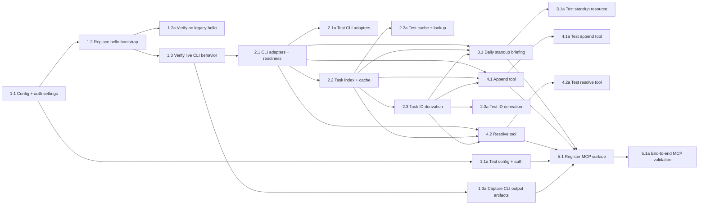

## 1. Server foundation
- [x] 1.1 Add configuration loading for bearer tokens, Obsidian CLI access, vault targeting, the recent-note window constant, and the upcoming planning-window constant.
- [x] 1.1a Verify configuration parsing and bearer-token enforcement with automated tests covering missing, invalid, and valid tokens.
- [x] 1.2 Remove the demo hello-world MCP surface and prepare the authenticated FastMCP server bootstrap for Obsidian features.
- [x] 1.2a Verify the server exposes no legacy hello tool and starts with the new authenticated bootstrap.
- [x] 1.3 Verify undocumented Obsidian CLI behavior against a live vault, including `tasks ... verbose format=json` field shape, scheduled-date visibility, missing-journal creation, and first-command launch/ownership behavior when Obsidian is already running vs when the handler becomes the launcher; lock the observed contract back into `design.md`.
- [x] 1.3a Verify 1.3 with captured command output artifacts and an end-to-end fixture vault under `tests/vault/handler-test-vault/`.

## 2. Obsidian domain layer

- [x] 2.1 Implement shared Obsidian CLI adapters for owned-process launch detection, readiness retries, reading journal notes, reading arbitrary notes, enumerating task data, appending content, creating missing notes, and mutating task status by CLI ref.
- [x] 2.1a Verify CLI adapter behavior with automated tests around command execution, owned-process reuse, restart after owned-process exit, readiness handling, parsing, and failure reporting.
- [x] 2.2 Implement task indexing, per-client cache validation, and lookup from current vault state to current CLI ref.
- [x] 2.2a Verify cache validation and lookup with automated tests covering stale cache invalidation, single-file refresh after mutation, and missing IDs.
- [x] 2.3 Implement task ID derivation from `file_path + task_text`, including source-order collision numbering.
- [x] 2.3a Verify task ID generation with automated tests covering duplicate base hashes, edited tasks, moved tasks, and source-order numbering.

## 3. Read model

- [x] 3.1 Implement `obsidian://daily-standup` assembly as a Markdown briefing with workflow description, `today_focus`, `upcoming`, `recent_unscheduled`, `recent_resolutions`, and `recent_notes`.
- [x] 3.1a Verify `obsidian://daily-standup` output against fixture data covering skipped days, overlapping recent-vs-scheduled tasks, project minutes grouping, nested list trees, empty recent history, and omission of far-future tasks.

## 4. Mutation tools

- [x] 4.1 Implement the `append` tool for `daily` and `notes/projects/{project}/.minutes.md`, including missing-note creation, list-item normalization, and `new_tasks` extraction.
- [x] 4.1a Verify `append` with automated tests covering daily append, project append, missing target creation, nested list items, prose-to-bullet normalization, and appended task ID returns.
- [x] 4.2 Implement the `resolve` tool for `done`, `dropped`, and `carried`, using current-state ID resolution before mutation and returning `new_id` for carried tasks.
- [x] 4.2a Verify `resolve` with automated tests covering all three resolutions, collision-numbered IDs, carry-forward creation in today's journal note, scheduled-task overlap after carry, and stale/missing ID errors.

## 5. MCP wiring and end-to-end validation

- [x] 5.1 Register `obsidian://daily-standup`, `append`, and `resolve` on the FastMCP server and connect them to the authentication, CLI, cache, task-ID, and Markdown-rendering layers.
- [x] 5.1a Verify end-to-end MCP behavior with an authenticated client flow against `tests/vault/handler-test-vault/` that reads the standup briefing, appends content, resolves tasks, confirms horizon/triage distinctions, and rejects unauthorized requests.

